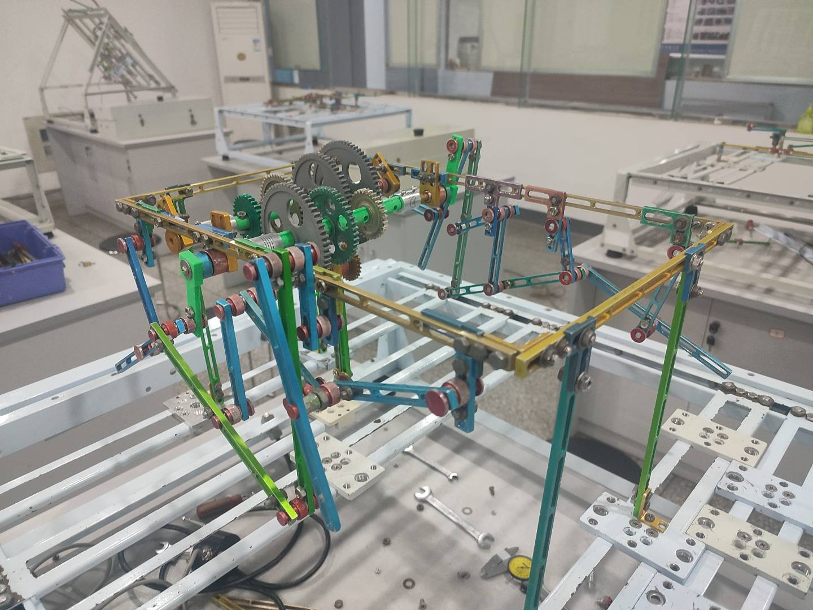
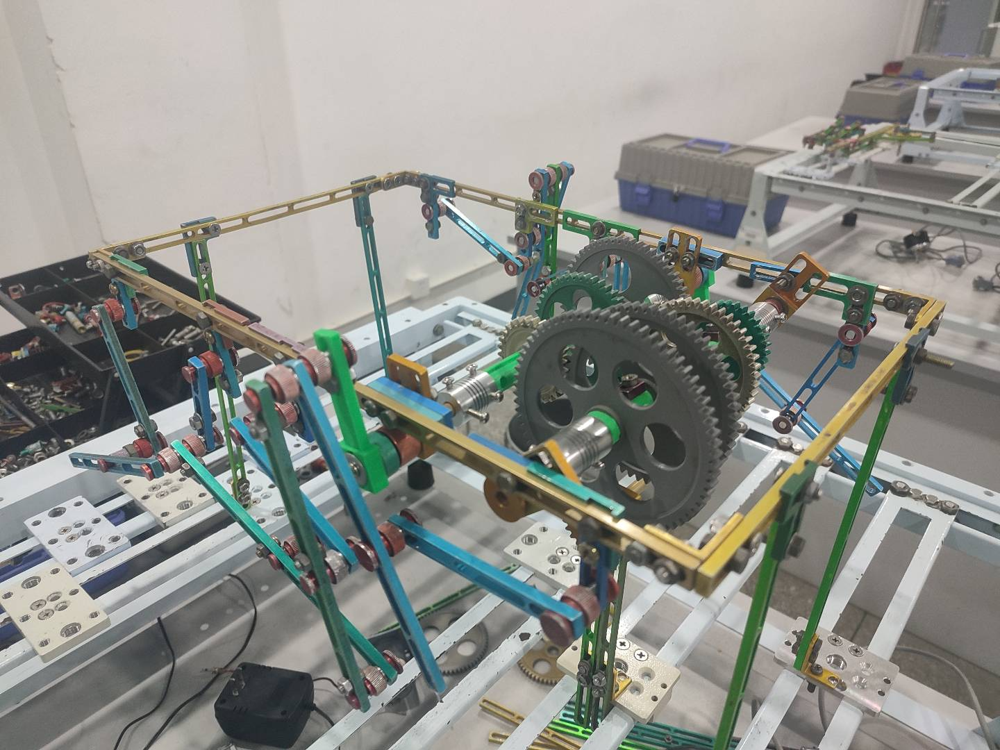

# Hexapod Carrying Robot

A six‑legged, material‑transporting robot designed and built as part of the “Mechanism Creativity Design & Practice” course at the University of Electronic Science and Technology of China. This project combines a biomimetic four‑bar leg mechanism with a sequential gearbox and a cam‑driven dumping mechanism to achieve stable walking, three‑speed drive, and controlled payload discharge.

---

## Table of Contents

- [Hexapod Carrying Robot](#hexapod-carrying-robot)
  - [Table of Contents](#table-of-contents)
  - [Features](#features)
  - [Mechanical Design](#mechanical-design)
    - [Leg Mechanism](#leg-mechanism)
    - [Tripod Gait Coordination](#tripodgait-coordination)
    - [Sequential Gearbox](#sequential-gearbox)
    - [Payload Dumping Mechanism](#payload-dumping-mechanism)
  - [Performance Specifications](#performance-specifications)
  - [Bill of Materials](#bill-of-materials)
  - [Assembly Instructions](#assembly-instructions)
  - [Motion Simulation \& Testing](#motion-simulation--testing)
  - [Operation Guide](#operation-guide)
  - [Known Issues \& Improvements](#known-issues--improvements)
  - [Future Work](#future-work)
  - [Contact](#contact)

---

## Features

- **Stable Tripod Gait**  
  - Each side consists of front and rear four‑bar linkages, with a centrally driven auxiliary leg to form a three‑point support at all times.  

- **Three‑Speed Drive + Neutral**  
  - Inspired by motorcycle sequential transmissions. Three selectable gear ratios (1:2, 1:1, 2:1) plus neutral for dumping.  

- **Cam‑Driven Dump Mechanism**  
  - When gearbox is in neutral, power is diverted to a cam and follower rod which tilts the payload bucket through a 60° swing.  

- **Modular & Lightweight**  
  - All leg members are assembled from standard aluminum rods and connectors. Custom 3D‑printed dog‑teeth and shafts ensure proper clutch engagement.  

---

## Mechanical Design

### Leg Mechanism

- **Structure**: Two four‑bar linkages per leg (rear crank + rocker driving front rocker), plus an auxiliary “middle” foot bar.  
- **Kinematic Analysis**:  
  - Four‑bar lengths: Crank = 63 mm, Rocker A = 95 mm, Rocker B = 110 mm, Frame = 77 mm (satisfies Grashof condition).  
  - Produces a lifted step height of ~113 mm and horizontal stride of ~146 mm per cycle.  

### Tripod Gait Coordination

- **Phasing**:  
  - Rear cranks on left/right sides set 180° apart.  
  - Middle auxiliary legs mirror each four‑bar’s motion to synchronize three legs in support and three in swing.  
- **Degrees of Freedom**:  
  - F = 3n – 2·Pl – Ph = 1 (single actuation drives one full gait cycle).

### Sequential Gearbox

- **Layout**: Two parallel shafts (input & output), three sliding gears with dog‑teeth collars, one neutral position.  
- **Gear Ratios**:  
  1. First Gear (1:2): 30‑tooth ⟷ 60‑tooth  
  2. Second Gear (1:1): 45‑tooth ⟷ 45‑tooth  
  3. Third Gear (2:1): 60‑tooth ⟷ 30‑tooth  
  4. Neutral: Intermediate slider dog engages secondary shaft’s lower idler gear to drive cam.  

### Payload Dumping Mechanism

- **Cam‑Follower Design**:  
  - In neutral, power is routed via belt and idler gear to a cam.  
  - A follower rod presses on the cam profile, driving a bucket linkage through 0–60° swing.  
- **Cycle Time**: ~4 s per dump stroke.

---

## Performance Specifications

| Parameter                           | Value                              |
|-------------------------------------|------------------------------------|
| Motor Speed                         | 30 rpm                             |
| Leg Cycle Time (30 rpm)             | 2.0 s                              |
| Foot‑Ground Contact Time            | 0.6 s                              |
| Step Length                         | 146 mm                             |
| Maximum Lift Height                 | 113 mm                             |
| Linear Speeds                       | 7.3 cm/s (1st), 14.6 cm/s (2nd), 29.2 cm/s (3rd) |
| Dump Angle                          | 60°                                |
| Dump Cycle Time                     | 4 s                                |

---

## Bill of Materials

| Item                         | Specification             | Qty |
|------------------------------|---------------------------|-----|
| Aluminum Rods & Connectors   | Standard Meccano‑style    | 50+ |
| Gears                        | 30, 45, 60 teeth, m = 1.5 | 6   |
| Custom Dog‑Teeth Collars     | 3D‑printed, m = 1.5       | 3   |
| Motor                        | 30 rpm, 12 V DC           | 1   |
| Bearings & Bushings          | φ 5–φ 10 mm               | 20  |
| Cam & Follower Components    | Steel rod & plate         | 1 set |
| Buckets & Linkage Plates     | Acrylic/PLA               | 1 set |
| Fasteners & Limit Nuts       | M3–M5 bolts & nuts        | 200 |
| Belts & Pulleys              | Timing belt, idler pulleys| 1 set |
| Rotary Encoder (optional)    | 360 P/R                   | 2   |

---

## Assembly Instructions

1. **Leg Sub‑Assembly**  
   - Bolt four‑bar linkages together; use limit‑nuts on slotted joints to prevent sliding.  
   - Install auxiliary foot bars at mid‑link hinge points.  
   - Mount front and rear leg pairs symmetrically on left/right frames.  

2. **Gearbox & Motor**  
   - Mount motor to input shaft gear; align dog‑tooth collars on output shaft.  
   - Test each gear position for smooth engagement.  

3. **Dump Mechanism**  
   - Fit cam on lower idler shaft; attach follower rod to bucket pivot.  
   - Route belt from neutral‑position gear to cam pulley.  

4. **Chassis & Frame**  
   - Build a tabletop‑frame fixture for stable walking tests.  
   - Secure all shafts in bearings; leave 0.5–1 mm play for tolerance.  

5. **Final Checks**  
   - Verify free rotation of all joints and gears in each position.  
   - Add washers or shims where necessary to eliminate binding.  

---

## Motion Simulation & Testing

- **Software**: SolidWorks Motion  
- **Test Protocol**:  
  - Drive rear crank at 30 rpm; record foot trajectories and contact time.  
  - Use angle sensors on motor and output shafts to compare theoretical vs. actual speeds.  
- **Results**:  
  - Average driven‑shaft speeds match expected gear ratios within ±5%.  
  - Outliers (3 in 1st gear, 5 in 2nd gear) filtered via 3σ rule; see `data_analysis.py`.

---

## Operation Guide

1. **Power On**: Connect 12 V DC to motor.  
2. **Select Gear**: Slide gearbox collar to desired position (1–2–3 or Neutral).  
3. **Start Walking**: Robot will walk in the selected speed.  
4. **Activate Dump**: Shift to Neutral, wait for cam cycle to complete bucket tilt, then return to walking mode.  
5. **Shutdown**: Shift to Neutral, remove power.

---

## Known Issues & Improvements

- **Joint Play**: Slotted connectors require limit nuts; consider custom printed joints for tighter fit.  
- **Gearbox Space**: Limited room for dog‑teeth—optimize collar length to restore four‑gear capability.  
- **Motor Coupling**: Soldered leads prone to intermittent contact—use a detachable connector.  

---

## Future Work

- **Lightweight Frame**: Replace aluminum rods with CNC‑cut PLA parts to reduce weight and improve precision.  
- **Integrated Clutch**: Implement a one‑way clutch for seamless in‑motion gear shifts.  
- **Autonomous Control**: Add microcontroller and gait‑planning algorithm for untethered operation.  
- **Sensor Fusion**: Integrate IMU and force sensors to adapt foot placement on uneven terrain.

---

## Contact

Project Team: Xuning Gou & Zhihan Cao  
Course Instructor: Prof. Ping Mu  
University of Electronic Science and Technology of China  
Mechanical & Electrical Engineering School  
Email: 1300464438@qq.com